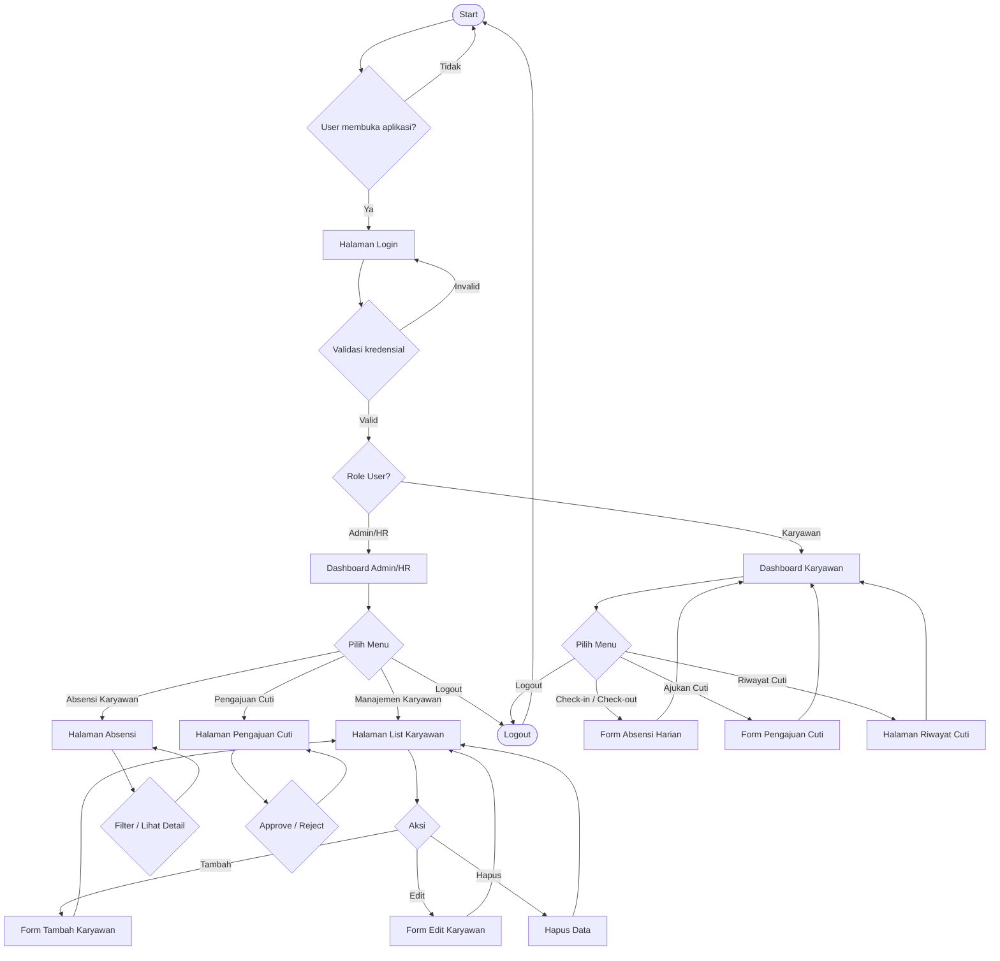
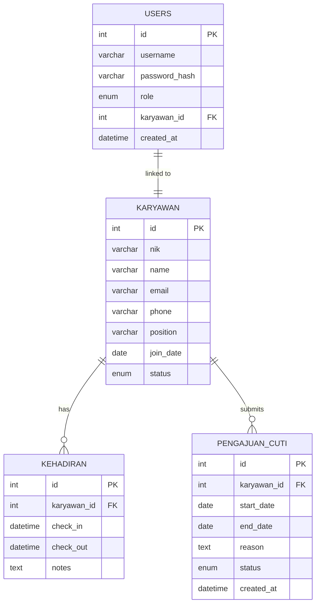
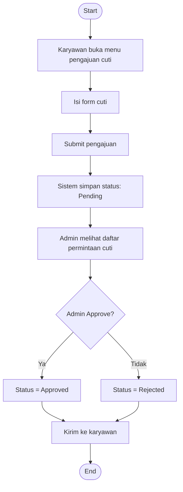
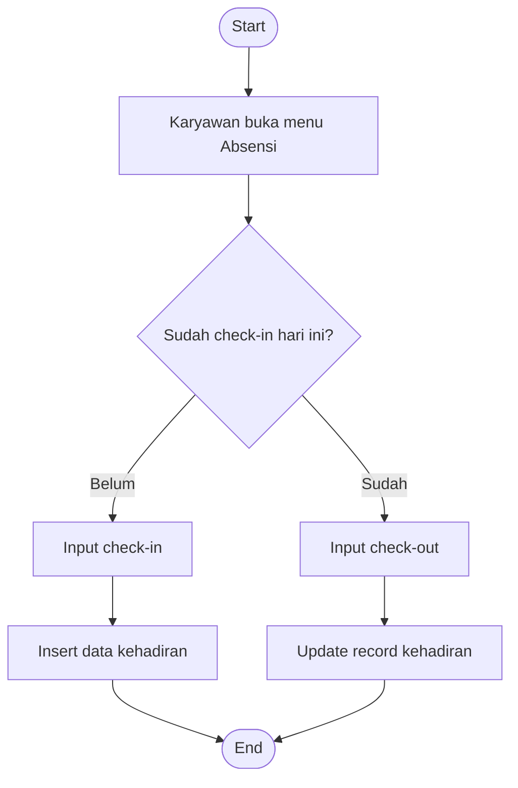

# HRIS - Human Resource Management System Architecture

## Overview
Project HRIS ini dibangun dengan arsitektur **MVC Architecture (Model–View–Controller)** yang sederhana namun terstruktur, menggabungkan PHP untuk logika backend, MySQL sebagai basis data, dan HTML dengan Tailwind CSS untuk tampilan frontend.

### Tech Stack
- **Backend**: PHP 8.2+ (Native PHP, no framework)
- **Database**: MySQL 8.0
- **Frontend**: HTML5 + Tailwind CSS 4.1 (via CDN) + Vanilla JavaScript
- **Server**: Apache/Nginx + PHP-FPM
- **Authentication**: Session-based authentication

### Arsitektur Aplikasi (MVC Pattern)
```
HRIS/
├── app/
│   ├── Controllers/                    # Logic aplikasi
│   │   ├── AuthController.php          # Login, logout, change password
│   │   ├── AttendanceController.php    # Manajemen absensi (admin & karyawan)
│   │   ├── BaseController.php          # Base controller dengan helper methods
│   │   ├── CutiController.php          # Manajemen pengajuan cuti (admin)
│   │   ├── FileController.php          # Secure file viewing
│   │   ├── KaryawanController.php      # CRUD karyawan (admin)
│   │   └── LeaveController.php         # Pengajuan cuti (karyawan)
│   ├── Models/                         # Data access layer
│   │   ├── Attendance.php              # Model absensi
│   │   ├── Karyawan.php                # Model karyawan
│   │   ├── LeaveRequest.php            # Model leave requests
│   │   └── PengajuanCuti.php           # Model pengajuan cuti (admin view)
│   ├── Views/                          # Template HTML (role-based structure)
│   │   ├── admin/                      # Admin-only views
│   │   │   ├── dashboard.php           # Dashboard admin
│   │   │   ├── attendance/
│   │   │   │   └── index.php           # Manajemen absensi
│   │   │   ├── employees/
│   │   │   │   ├── index.php           # List karyawan
│   │   │   │   └── form.php            # Form tambah/edit karyawan
│   │   │   └── leave/
│   │   │       └── index.php           # Manajemen pengajuan cuti
│   │   ├── employee/                   # Employee-only views
│   │   │   ├── dashboard.php           # Dashboard karyawan
│   │   │   ├── attendance.php          # Absensi karyawan
│   │   │   └── leave/
│   │   │       ├── index.php           # Riwayat cuti
│   │   │       └── create.php          # Form pengajuan cuti
│   │   ├── auth/                       # Public authentication
│   │   │   ├── login.php               # Landing page login
│   │   │   ├── login-admin.php         # Login admin
│   │   │   ├── login-karyawan.php      # Login karyawan
│   │   │   └── change-password.php     # Ganti password
│   │   ├── layouts/                    # Templates & Components
│   │   │   ├── header.php
│   │   │   ├── footer.php
│   │   │   ├── sidebar.php
│   │   │   ├── sidebar-admin.php
│   │   │   ├── sidebar-karyawan.php
│   │   │   └── components/
│   │   │       ├── alerts.php          # Reusable alert component
│   │   │       └── pagination.php      # Reusable pagination
│   │   └── errors/                     # Error pages
│   │       ├── 404.php
│   │       └── 403.php
│   ├── Core/                           # Router, Database, Helper
│   │   ├── Database.php                # Koneksi database
│   │   ├── Router.php                  # Routing system
│   │   ├── Env.php                     # Environment loader (.env)
│   │   └── Helpers.php                 # Helper functions
│   └── config.php                      # Konfigurasi aplikasi
├── public/                             # Document root
│   ├── index.php                       # Front controller
│   └── assets/                         # CSS, JS, images
│       ├── css/
│       │   ├── input.css               # Tailwind input
│       │   └── output.css              # Compiled CSS
│       └── js/
│           ├── theme.js                # Theme switcher (light/dark)
│           └── apply-theme.js          # Apply theme on load
├── storage/                            # File storage (outside web root)
│   └── leave_attachments/              # Leave request attachments
├── scripts/
│   └── register.php                    # Script buat akun admin (dev only)
├── database/
│   └── query.sql                       # Database schema
├── docs/                               # Documentation
│   ├── FRONTEND_DASHBOARD_ADMIN.md
│   ├── FRONTEND_DASHBOARD_KARYAWAN.md
│   └── SEPARATED_LOGIN.md
├── .env.example                        # Environment template
├── .gitignore
├── ARCHITECTURE.md                     # Architecture documentation
├── CHANGELOG.md                        # Version history
├── package.json                        # Node dependencies
├── tailwind.config.js                  # Tailwind configuration
└── README.md
```


### Request Flow (MVC)
1. **Model** → logika data & query database
2. **View** → file tampilan (HTML, Tailwind)
3. **Controller** → logika aplikasi & routing
4. **Core** → library internal, router, session, hel

## Flowchart Utama HRMS


## ERD


### Penjelasan Model Data
**Tabel: users**
Menyimpan akun login untuk semua jenis user.
| Field         | Tipe                      | Keterangan          |
| ------------- | ------------------------- | ------------------- |
| id            | INT PK                    | Auto increment      |
| username      | VARCHAR                   | Unique              |
| password_hash | VARCHAR                   | Hasil bcrypt        |
| role          | ENUM(admin, karyawan) | Menentukan akses    |
| karyawan_id   | INT                       | Null untuk Admin |
| created_at    | DATETIME                  | Timestamp           |


**Tabel: karyawan**
Data lengkap setiap karyawan.
| Field     | Tipe                   | Keterangan           |
| --------- | ---------------------- | -------------------- |
| id        | INT PK                 | Auto                 |
| nik       | VARCHAR                | Nomor induk karyawan |
| name      | VARCHAR                | Nama lengkap         |
| email     | VARCHAR                | Email                |
| phone     | VARCHAR                | Telepon              |
| position  | VARCHAR                | Jabatan              |
| join_date | DATE                   | Tanggal masuk kerja  |
| status    | ENUM(active, inactive) | Status kerja         |

**Tabel: attendance**
Log presensi harian.
| Field       | Tipe     | Keterangan                           |
| ----------- | -------- | ------------------------------------ |
| id          | INT PK   | Auto                                 |
| karyawan_id | INT FK   | Relasi ke karyawan                  |
| check_in    | DATETIME | Waktu masuk                          |
| check_out   | DATETIME | Waktu pulang                         |
| notes       | TEXT     | Opsional (lokasi, alasan telat, dll) |

**Tabel: pengajuan_cuti**
Pengajuan cuti oleh karyawan.
| Field       | Tipe                              | Keterangan       |
| ----------- | --------------------------------- | ---------------- |
| id          | INT PK                            | Auto             |
| karyawan_id | INT FK                            | Karyawan pengaju |
| start_date  | DATE                              | Awal cuti        |
| end_date    | DATE                              | Akhir cuti       |
| reason      | TEXT                              | Alasan           |
| status      | ENUM(pending, approved, rejected) | Status workflow  |
| created_at  | DATETIME                          | Timestamp        |


## Use Case Diagram (Admin & karyawan)

## Activity Diagram Proses Login (Admin & Karyawan)


## Activity Diagram Pengajuan & Persetujuan Cuti


## Activity Diagram Pencatatan Kehadira (Check-in / Check-out)


## Activity Diagram Penggajian (Admin) - Optional Feature


## Spesifikasi API (MVP)

## Halaman/Route Utama
- GET /login → form login
- POST /api/login → proses login
- GET /dashboard → redirect sesuai role: /admin/dashboard atau /employee/dashboard
- Admin:
    - GET /admin/dashboard
    - GET /admin/karyawan (+ create/edit)
    - GET /admin/absensi
    - GET /admin/cuti
- Karyawan:
    - GET /employee/dashboard
    - GET /employee/absensi (check-in/out)
    - GET /employee/cuti (ajukan + riwayat)

---

## Keamanan Minimum
- Hash password (bcrypt), rate-limit login sederhana (counter di session, delay progresif), CSRF token untuk form.
- Escape output di views (hindari XSS), validasi dan sanitasi input (filter_var, prepared statements PDO).
- Session cookie `httponly` dan `secure` (jika via HTTPS). Regenerasi session id setelah login.
.
