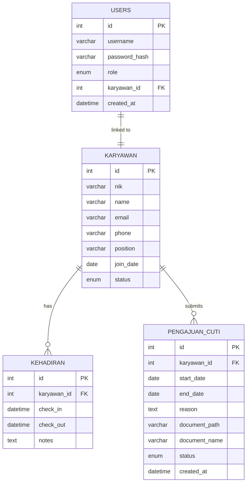
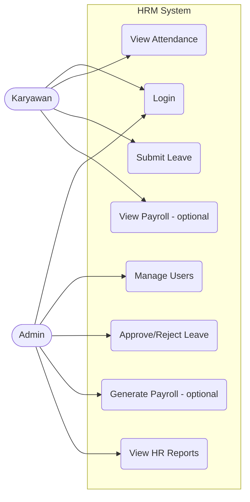
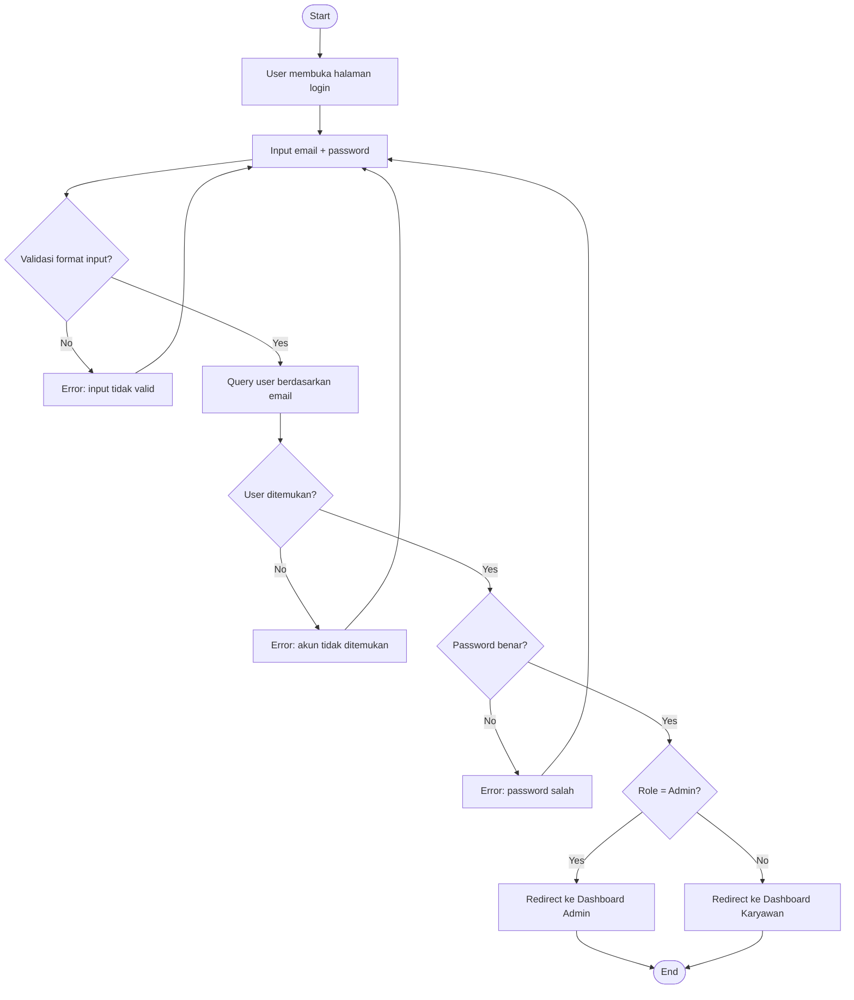
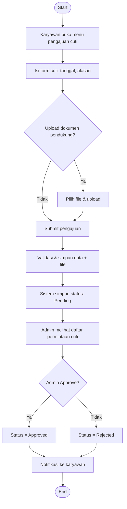
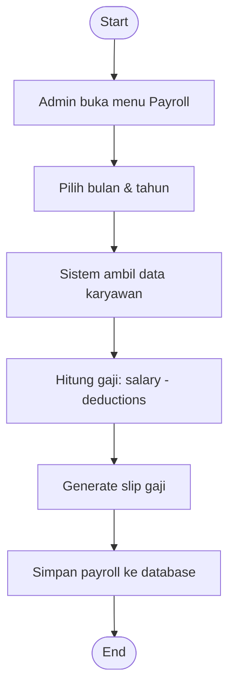

# HRIS - Human Resource Management System Architecture

## Overview
Project HRIS ini dibangun dengan arsitektur **MVC Architecture (Model–View–Controller)** yang sederhana namun terstruktur, menggabungkan PHP untuk logika backend, MySQL sebagai basis data, dan HTML dengan Tailwind CSS untuk tampilan frontend.

### Tech Stack
- **Backend**: PHP 8.2+ (Native PHP, no framework)
- **Database**: MySQL 8.0
- **Frontend**: HTML5 + Tailwind CSS 4.1 (via CDN) + Vanilla JavaScript
- **Server**: Apache/Nginx + PHP-FPM
- **Authentication**: Session-based authentication (No self-registration for employees)

### Authentication Flow
**Admin:**
- Login dengan kredensial yang sudah ada (pre-seeded di database)

**Karyawan:**
- **TIDAK ADA** halaman register/sign up
- Akun dibuat oleh Admin melalui menu "Manajemen Karyawan"
- Admin input data karyawan lengkap + set username & password default
- Karyawan menerima kredensial dari HR/Admin → login pertama kali
- (Optional) Karyawan ganti password setelah login pertama

### Arsitektur Aplikasi (MVC Pattern)
hris-project/
├─ public/                     # Root yang diakses browser
│  ├─ index.php                # Router/front controller
│  ├─ assets/
│  │  ├─ css/
│  │  │  └─ style.css          # Output build Tailwind
│  │  ├─ js/
│  │  │  └─ app.js             # Script utama
│  │  └─ img/
│  ├─ uploads/                 # File karyawan / foto profil
│  └─ .htaccess                # Routing mod_rewrite
│
├─ app/
│  ├─ Controllers/
│  │  ├─ AuthController.php
│  │  ├─ DashboardController.php
│  │  ├─ AttendanceController.php
│  │  ├─ LeaveController.php
│  │
│  ├─ Models/
│  │  ├─ User.php
│  │  ├─ Attendance.php
│  │  └─ LeaveRequest.php
│  │
│  ├─ Views/
│  │  ├─ layouts/
│  │  │  ├─ header.php
│  │  │  └─ footer.php
│  │  ├─ auth/
│  │  │  └─ login.php
│  │  ├─ dashboard/
│  │  │  ├─ admin.php
│  │  │  └─ employee.php
│  │  ├─ attendance/
│  │  │  ├─ index.php
│  │  └─ leave/
│  │     ├─ index.php
│  │     └─ submit.php
│  │
│  ├─ Core/
│  │  ├─ Database.php           # Koneksi MySQL (PDO)
│  │  ├─ Router.php             # Pengatur route
│  │  ├─ Session.php            # Auth handler
│  │  └─ Helpers.php
│  │
│  └─ config.php                # Konfigurasi environment
│
├─ storage/
│  └─ logs/
│     └─ app.log                # (optional) logging
│
├─ tailwind.config.js
├─ package.json                 # Jika ingin build Tailwind
├─ composer.json                # Jika mau pakai autoload PSR-4 (opsional)
└─ README.md


### Request Flow (MVC)
1. **Model** → logika data & query database
2. **View** → file tampilan (HTML, Tailwind)
3. **Controller** → logika aplikasi & routing
4. **Core** → library internal, router, session, hel

## Flowchart Utama HRMS
```mermaid
flowchart TD

%% === START ===
A([Start]) --> B{User membuka aplikasi?}

B -->|Ya| C[Halaman Login]
B -->|Tidak| A

%% === LOGIN ===
C --> D{Validasi kredensial}

D -->|Valid| E{Role User?}
D -->|Invalid| C

E -->|Admin| F[Dashboard Admin]
E -->|Karyawan| G[Dashboard Karyawan]++

%% === DASHBOARD Admin ===
F --> H{Pilih Menu}

H -->|Manajemen Karyawan| I[Halaman List Karyawan]
H -->|Absensi Karyawan| J[Halaman Absensi]
H -->|Pengajuan Cuti| K[Halaman Pengajuan Cuti]
H -->|Logout| Z([Logout])

%% === KARYAWAN CRUD ===
I --> I1{Aksi}
I1 -->|Tambah| I2[Form Tambah Karyawan]
I1 -->|Edit| I3[Form Edit Karyawan]
I1 -->|Hapus| I4[Hapus Data]
I2 --> I
I3 --> I
I4 --> I

%% === ABSENSI ADMIN ===
J --> J1{Filter / Lihat Detail}
J1 --> J

%% === CUTI ADMIN ===
K --> K1{Approve / Reject}
K1 --> K

%% === DASHBOARD KARYAWAN ===
G --> L{Pilih Menu}
L -->|Check-in / Check-out| M[Form Absensi Harian]
L -->|Ajukan Cuti| N[Form Pengajuan Cuti]
L -->|Riwayat Cuti| O[Halaman Riwayat Cuti]
L -->|Logout| Z

M --> G
N --> G
O --> G

%% === END ===
Z --> A
```

## ERD


### Penjelasan Model Data
**Tabel: users**
Menyimpan akun login untuk semua jenis user.
| Field         | Tipe                      | Keterangan          |
| ------------- | ------------------------- | ------------------- |
| id            | INT PK                    | Auto increment      |
| username      | VARCHAR                   | Unique              |
| password_hash | VARCHAR                   | Hasil bcrypt        |
| role          | ENUM(admin, karyawan) | Menentukan akses    |
| karyawan_id   | INT                       | Null untuk Admin |
| created_at    | DATETIME                  | Timestamp           |


**Tabel: karyawan**
Data lengkap setiap karyawan.
| Field     | Tipe                   | Keterangan           |
| --------- | ---------------------- | -------------------- |
| id        | INT PK                 | Auto                 |
| nik       | VARCHAR                | Nomor induk karyawan |
| name      | VARCHAR                | Nama lengkap         |
| email     | VARCHAR                | Email                |
| phone     | VARCHAR                | Telepon              |
| position  | VARCHAR                | Jabatan              |
| join_date | DATE                   | Tanggal masuk kerja  |
| status    | ENUM(active, inactive) | Status kerja         |

**Tabel: attendance**
Log presensi harian.
| Field       | Tipe     | Keterangan                           |
| ----------- | -------- | ------------------------------------ |
| id          | INT PK   | Auto                                 |
| karyawan_id | INT FK   | Relasi ke karyawan                  |
| check_in    | DATETIME | Waktu masuk                          |
| check_out   | DATETIME | Waktu pulang                         |
| notes       | TEXT     | Opsional (lokasi, alasan telat, dll) |

**Tabel: pengajuan_cuti**
Pengajuan cuti oleh karyawan.
| Field         | Tipe                              | Keterangan                               |
| ------------- | --------------------------------- | ---------------------------------------- |
| id            | INT PK                            | Auto                                     |
| karyawan_id   | INT FK                            | Karyawan pengaju                         |
| start_date    | DATE                              | Awal cuti                                |
| end_date      | DATE                              | Akhir cuti                               |
| reason        | TEXT                              | Alasan                                   |
| document_path | VARCHAR(255)                      | Path file dokumen pendukung (nullable)   |
| document_name | VARCHAR(255)                      | Nama asli file yang diupload (nullable)  |
| status        | ENUM(pending, approved, rejected) | Status workflow                          |
| created_at    | DATETIME                          | Timestamp                                |


## Use Case Diagram (Admin & karyawan)

## Activity Diagram Proses Login (Admin & Karyawan)


## Activity Diagram Pengajuan & Persetujuan Cuti


## Activity Diagram Pencatatan Kehadira (Check-in / Check-out)


## Activity Diagram Penggajian (Admin) - Optional Feature


---

## Keamanan Minimum
- Hash password (bcrypt), rate-limit login sederhana (counter di session, delay progresif), CSRF token untuk form.
- Escape output di views (hindari XSS), validasi dan sanitasi input (filter_var, prepared statements PDO).
- Session cookie `httponly` dan `secure` (jika via HTTPS). Regenerasi session id setelah login.
.
