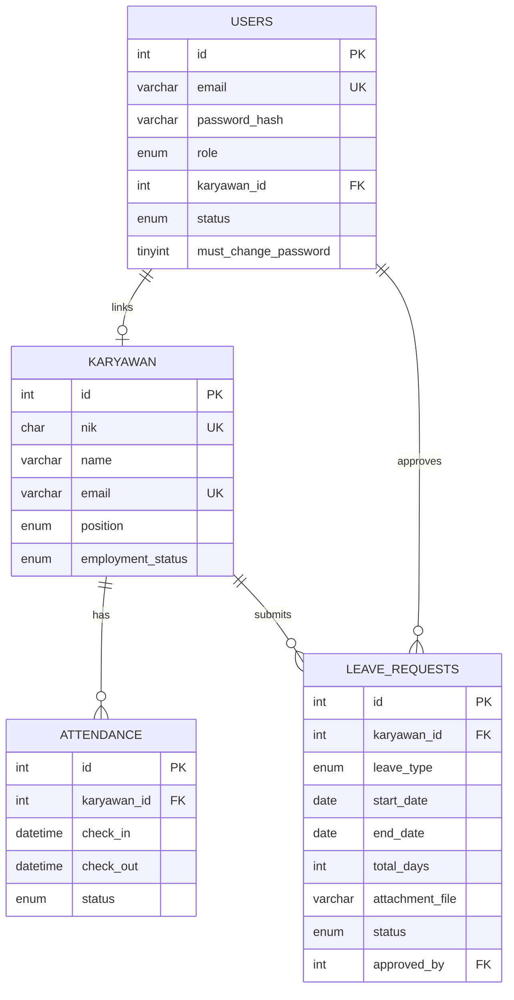

# HRIS - Human Resource Management System Architecture

## Overview
HRIS adalah aplikasi manajemen SDM berbasis **MVC Pattern** menggunakan Native PHP, MySQL, Tailwind CSS, dan Flowbite.

### Tech Stack
- **Backend**: PHP 8.2+ (Native, no framework)
- **Database**: MySQL 8.0
- **Frontend**: Tailwind CSS 4.1 + Flowbite 4.0 + Vanilla JS
- **Authentication**: Session-based (email login, bcrypt hashing)

### Struktur Folder
```
HRIS/
├── app/
│   ├── Controllers/         # Auth, Karyawan, Attendance, Leave, Cuti, File
│   ├── Models/              # User, Karyawan, Attendance, LeaveRequest, PengajuanCuti
│   ├── Views/               # admin/, employee/, auth/, layouts/, errors/
│   ├── Core/                # Database, Router, Env, Helpers
│   └── config.php
├── public/                  # index.php, assets/
├── storage/                 # leave_attachments/
├── scripts/                 # register.php, inject_karyawan.php
├── database/                # query.sql
└── docs/                    # Documentation
```

### Request Flow
**Client** → **Front Controller** → **Router** → **Controller** → **Model** → **Database** → **View** → **Response**

**Core Components:**
- `Database.php` - MySQLi connection
- `Router.php` - Route matching & dynamic routes
- `Helpers.php` - `base_url()`, `url()`, `asset()`, `redirect()`, `setFlash()`, `getFlash()`
- `Env.php` - Load .env variables

---

## ERD


### Database Schema

**users** - Akun login
- `email` VARCHAR(150) UNIQUE - Login email
- `password_hash` VARCHAR(255) - Bcrypt hash
- `role` ENUM('super_admin','admin','karyawan')
- `karyawan_id` INT NULL FK
- `must_change_password` TINYINT(1)

**karyawan** - Data karyawan
- `nik` CHAR(16) UNIQUE - NIK 16 digit
- `name`, `email`, `phone`
- `position` ENUM('Backend Developer','Frontend Developer','Fullstack Developer','DevOps / Cloud Engineer','QA / Software Tester')
- `employment_status` ENUM('active','resigned')

**attendance** - Log presensi
- `karyawan_id` INT FK
- `check_in`, `check_out` DATETIME
- `status` ENUM('present','late','half_day')
- Index: `idx_karyawan_date`

**leave_requests** - Pengajuan cuti
- `karyawan_id` INT FK
- `leave_type` ENUM('annual','sick','emergency','unpaid')
- `start_date`, `end_date`, `total_days`
- `attachment_file` VARCHAR(255)
- `status` ENUM('pending','approved','rejected')
- `approved_by` INT FK
- Index: `idx_karyawan_status`, `idx_dates`

---

## Routes

**Authentication**
- `GET /` - Landing login page
- `GET|POST /admin/login` - Admin login
- `GET|POST /karyawan/login` - Karyawan login
- `GET /logout` - Logout
- `GET|POST /change-password` - Change password

**Admin**
- `GET /admin/dashboard` - Dashboard
- `GET /admin/karyawan` - List karyawan (CRUD)
- `GET /admin/attendance` - Manage attendance, export CSV
- `GET /admin/cuti` - Approve/reject leave requests

**Karyawan**
- `GET /karyawan/dashboard` - Dashboard
- `GET /karyawan/attendance` - Check-in/out
- `GET /karyawan/leave` - Submit & view leave requests

**Dynamic**
- `GET /file/leave/{id}` - Secure file viewing

---

## Security

**Authentication**
- Email login + bcrypt password hashing
- Role-based access control (super_admin, admin, karyawan)
- Session management + forced password change
- Account status validation

**Database**
- Prepared statements (MySQLi)
- Parameter binding (prevent SQL injection)
- Foreign key constraints
- ENUM types validation

**File Upload**
- Storage outside webroot (`storage/`)
- Type validation (PDF, JPG, PNG)
- Size limit 10MB
- Role-based access control

**Input/Output**
- Email validation (`filter_var`)
- NIK validation (16 digits)
- XSS prevention (escape output)
- Path sanitization

**Production Checklist**
- ✅ CSRF tokens
- ✅ Rate limiting
- ✅ Secure session cookies
- ✅ HTTPS
- ✅ .env for credentials

---

## Controllers & Models

**Controllers:**
- `BaseController` - Helper methods (auth, view rendering, 403/404)
- `AuthController` - Login, logout, dashboard, change password
- `KaryawanController` - Admin: CRUD karyawan
- `AttendanceController` - Admin: manage attendance, CSV export | Karyawan: check-in/out
- `LeaveController` - Karyawan: submit & view leave
- `CutiController` - Admin: approve/reject leave
- `FileController` - Secure file viewing

**Models:**
- `User` - Authentication, account management
- `Karyawan` - Employee CRUD, statistics
- `Attendance` - Attendance tracking, statistics
- `LeaveRequest` - Leave submission (karyawan view)
- `PengajuanCuti` - Leave approval (admin view)

---

## Development

**Setup:**
1. `npm install` - Install dependencies
2. Import `database/query.sql` - Setup database
3. Copy `.env.example` → `.env` - Configure DB
4. `npm run dev` - Build CSS
5. `php scripts/register.php` - Create admin
6. Access app (XAMPP/PHP server/Virtual Host)

**Commands:**
```bash
npm run dev          # Watch mode Tailwind
npm run build        # Production build
php -S localhost:8000 -t public  # PHP server
```

**Deployment:**
- Set `.env` credentials
- Build production CSS
- Set `storage/` permissions
- Configure webserver (document root: `public/`)
- Enable HTTPS

---

## Documentation
- [README.md](README.md) - Setup & features
- [CHANGELOG.md](CHANGELOG.md) - Version history
- [docs/](docs/) - Feature documentation
